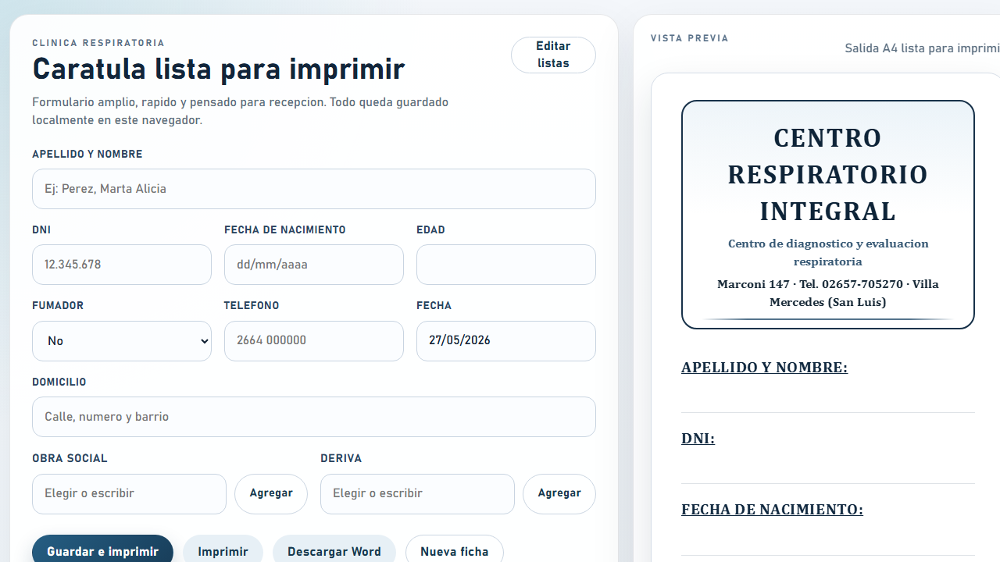

# Clinical Cover Sheet Generator

Lightweight clinic workflow app used daily by secretaries to fill patient intake data, generate a clean cover sheet, print it quickly, and export a Word file when manual edits are needed.

The project was built for a real respiratory clinic workflow where speed, readability, and low-friction printing matter more than unnecessary complexity.



## Live Project

- Production URL: [auto-form-clinical.vercel.app](https://auto-form-clinical.vercel.app)
- Repository: [github.com/tonysoprano33/auto-form-clinical](https://github.com/tonysoprano33/auto-form-clinical)

## What It Does

- Lets a secretary complete a patient cover sheet in a few seconds.
- Keeps the form simple and readable for high-frequency daily use.
- Formats `DNI` and dates while typing.
- Calculates age automatically from birth date and visit date.
- Defaults `Smoker` to `No`.
- Defaults the visit date to today.
- Supports editable lists for health insurance providers and referring doctors.
- Shows type-ahead suggestions while typing.
- Generates a print-friendly A4 output.
- Exports a `.docx` file for manual correction when needed.
- Stores app state locally in the browser with `localStorage`.

## Why This Project Matters

This is not just a demo UI.

It is an operational tool used in a clinic by real staff, every day. It reduces repetitive typing, avoids reformatting in Word, and makes the intake-print workflow much faster for the secretaries.

## Product Decisions

- Built as a lightweight web app instead of a heavy desktop app to remove installation friction.
- No backend for this stage: data stays in the browser of the machine being used.
- Printing is generated through a PDF flow for more consistent output across browsers.
- Word export is kept because clinics sometimes need last-minute edits before final printing.
- Typography and spacing were designed around legibility for older readers.

## Core Features

### Form workflow

- Fast keyboard-friendly entry.
- `Enter` moves through the form.
- Required validation for patient name and visit date before output.
- Empty fields stay blank instead of showing filler text.

### Dynamic lists

- Add new health insurance providers.
- Add new referring doctors.
- Keep defaults like `Particular` and `DR GUSTAVO PIGUILLEM` available as suggestions without forcing them into the field.

### Output

- Browser preview of the cover sheet.
- PDF-based print flow for consistent A4 output.
- Word export with the same structure for manual adjustments.

## Tech Stack

- `Vite`
- `TypeScript`
- `HTML/CSS`
- `docx`
- `jsPDF`
- `Vercel`

## Local Development

```bash
npm install
npm run dev
```

## Production Build

```bash
npm run build
```

## Deployment

The app is configured for a simple Vercel deployment.

- Build command: `npm run build`
- Output directory: `dist`

## Data Handling

This version does not use a backend or database.

- Form state is stored in `localStorage`
- Insurance and doctor lists are stored in `localStorage`
- Data is local to the browser on that machine

That makes this version easy to deploy and easy to use in a clinic environment where the goal is quick intake + print, not full medical record management.

## Real-World Context

The app was created for a respiratory clinic in Villa Mercedes, San Luis, Argentina.

It is part of a broader pattern in my work: observing real operational friction, then building simple software that removes repetitive manual steps without making the workflow harder for non-technical users.
